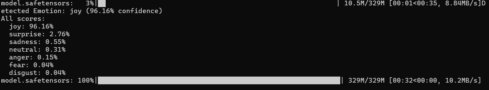

# ai-feeling:
Analisys of the ai feelings with  Python.

Example Run:

```
$ python emotion_ai.py "I am so happy today!"
Detected Emotion: joy (99.12% confidence)
All scores:
  joy: 99.12%
  surprise: 0.45%
  love: 0.23%
  anger: 0.12%
  sadness: 0.05%
  fear: 0.03%

```



Windows:
https://learn.microsoft.com/en-us/windows/advanced-settings/developer-mode